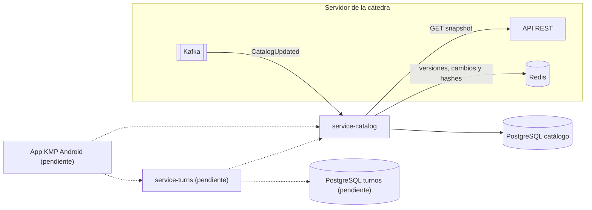

```mermaid
flowchart LR
    KMP["App KMP Android (pendiente)"]
    CAT["service-catalog"]
    TUR["service-turns (pendiente)"]
    DBC[("PostgreSQL catálogo")]
    DBT[("PostgreSQL turnos (pendiente)")]
    subgraph CATEDRA["Servidor de la cátedra"]
        REST["API REST"]
        REDIS[("Redis")]
        KAFKA[["Kafka"]]
    end
    CAT --> DBC
    CAT -->|"GET snapshot"| REST
    CAT -->|"versiones, cambios y hashes"| REDIS
    KAFKA -->|"CatalogUpdated"| CAT
    KMP -.-> CAT
    KMP -.-> TUR
    TUR -.-> CAT
    TUR -.-> DBT
```