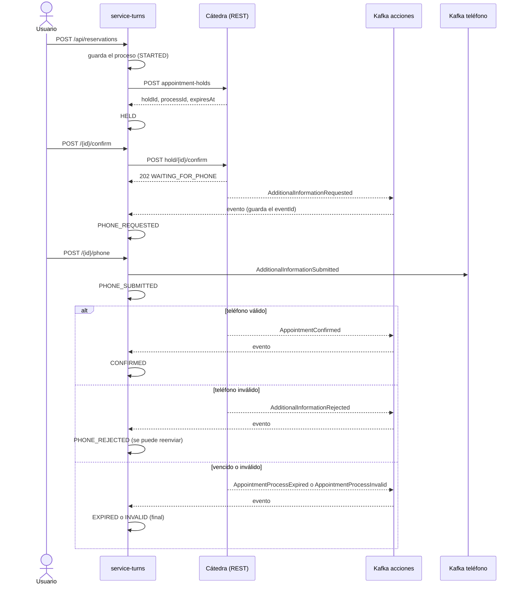

# Secuencia de la reserva (REST y Kafka)

```mermaid
sequenceDiagram
    actor U as Usuario
    participant T as service-turns
    participant C as Cátedra (REST)
    participant KA as Kafka acciones
    participant KP as Kafka teléfono

    U->>T: POST /api/reservations
    T->>T: guarda el proceso (STARTED)
    T->>C: POST appointment-holds
    C-->>T: holdId, processId, expiresAt
    T->>T: HELD
    U->>T: POST /{id}/confirm
    T->>C: POST hold/{id}/confirm
    C-->>T: 202 WAITING_FOR_PHONE
    C-->>KA: AdditionalInformationRequested
    KA-->>T: evento (guarda el eventId)
    T->>T: PHONE_REQUESTED
    U->>T: POST /{id}/phone
    T->>KP: AdditionalInformationSubmitted
    T->>T: PHONE_SUBMITTED
    alt teléfono válido
        C-->>KA: AppointmentConfirmed
        KA-->>T: evento
        T->>T: CONFIRMED
    else teléfono inválido
        C-->>KA: AdditionalInformationRejected
        KA-->>T: evento
        T->>T: PHONE_REJECTED (se puede reenviar)
    else vencido o inválido
        C-->>KA: AppointmentProcessExpired o AppointmentProcessInvalid
        KA-->>T: evento
        T->>T: EXPIRED o INVALID (final)
    end
```