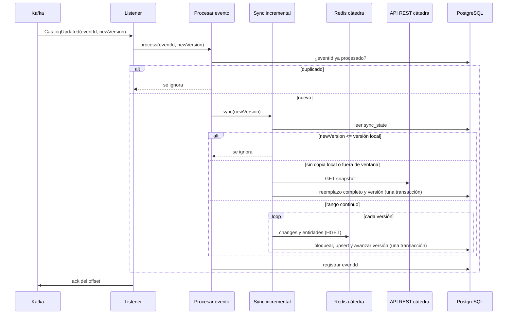

```mermaid
sequenceDiagram
    participant K as Kafka
    participant L as Listener
    participant P as Procesar evento
    participant S as Sync incremental
    participant R as Redis cátedra
    participant A as API REST cátedra
    participant DB as PostgreSQL

    K->>L: CatalogUpdated(eventId, newVersion)
    L->>P: process(eventId, newVersion)
    P->>DB: ¿eventId ya procesado?
    alt duplicado
        P-->>L: se ignora
    else nuevo
        P->>S: sync(newVersion)
        S->>DB: leer sync_state
        alt newVersion <= versión local
            S-->>P: se ignora
        else sin copia local o fuera de ventana
            S->>A: GET snapshot
            S->>DB: reemplazo completo y versión (una transacción)
        else rango continuo
            loop cada versión
                S->>R: changes y entidades (HGET)
                S->>DB: bloquear, upsert y avanzar versión (una transacción)
            end
        end
        P->>DB: registrar eventId
    end
    L->>K: ack del offset
```